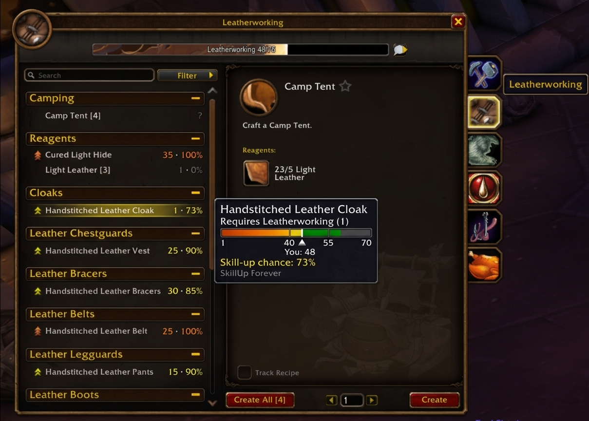

# SkillUp Forever

Classic profession-levelling numbers in WoW: Forever's retail Professions window.



- **Every recipe row** shows the skill it needs and your chance of a skill-up, coloured by difficulty: `125 · 62%`.
- **Hover a recipe** for its orange / yellow / green / grey thresholds on a bar, with your current skill marked.
- **Sort** recipes within each category by required skill or skill-up chance (Settings → AddOns → SkillUp Forever).
- The game's own *Only skill-ups* filter works alongside it.

`/su` opens the settings. `/su audit` (with a profession open) checks the bundled thresholds against the colours the game shows and prints any mismatch — please report those.

Skill-up chance uses the Classic formula: orange 100%, yellow and green `(grey − skill) / (grey − yellow)`, grey 0%. Recipes without data show `?`.

## Development

```sh
ln -s "$PWD" "$HOME/Games/battlenet/drive_c/Program Files (x86)/World of Warcraft/_classic_beta_/Interface/AddOns/SkillUpForever"
luacheck .
luajit tests/model_spec.lua
python3 tools/gen_thresholds.py   # regenerate Data/Thresholds.lua
```

## Licence

GPL-3.0-or-later. Threshold baseline partly derived from [Skillet-Classic](https://github.com/b-morgan/Skillet-Classic) (GPL-3.0-or-later); per-build values from the game's `SkillLineAbility` data via [wago.tools](https://wago.tools).
